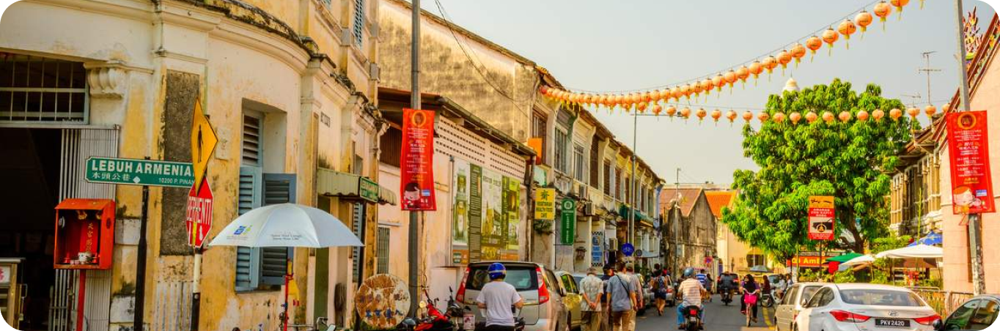
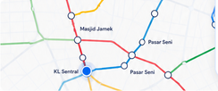
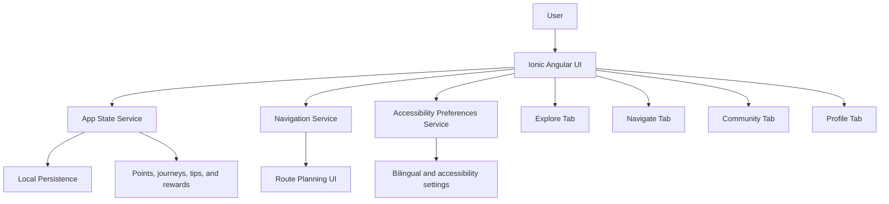

# MyTravel


Unified responsive web-based application for nationwide tourism and real-time transportation integration in Malaysia.

MyTravel is a cross-platform tourism and travel-planning app built with Ionic, Angular, and Capacitor. It combines journey planning, community travel tips, accessibility preferences, digital passport-style progression, and lightweight rewards mechanics into one mobile-friendly experience.

The capstone proposal positions MyTravel as a smart tourism platform for Malaysia that connects tourism discovery with public transport, supports bilingual use, and encourages more sustainable travel behavior through gamification.

## Screenshots

<p align="center">
  
  
  
</p>

<p align="center">
  
  
  
</p>

## Key Features

- Responsive tab-based UI for explore, navigation, community, and profile flows
- English and Bahasa Melayu language switching
- Accessibility preferences for contrast, motion, text sizing, and route handling
- Journey planning with transport mode selection and route summaries
- Community travel tips, saved notices, and verification tasks
- Digital passport-style stamps and seasonal challenge tracking
- Local state persistence for journeys, contributions, points, and preferences
- Mobile-first experience designed for browser and native wrapper deployment

## Overview

MyTravel focuses on four main experiences:

- `Explore` for the landing experience, featured destinations, events, verification prompts, and journey summaries.
- `Navigate` for public-transport journey planning and route selection.
- `Community` for travel tips, notices, and verification tasks.
- `Profile` for account details, points, passport stamps, accessibility settings, and progress tracking.

The app is designed for:

- Malaysian tourism use cases
- Public-transport-first trip planning
- Bilingual interaction in English and Bahasa Melayu
- Accessibility-aware navigation and content presentation

## Architecture

MyTravel currently ships as a responsive Ionic Angular client with local app-state management. The proposal documents describe a broader cloud-backed architecture, but the present repository mainly contains the front-end foundation and state logic.



### Current Implementation

- Angular services manage state for journeys, points, tips, and accessibility preferences.
- Tab pages organize the app into explore, navigation, community, and profile sections.
- UI text is localized in English and BM across the main flows.
- The app persists selected local state so the experience survives refreshes.

### Planned From the Proposal

- Firebase and Firestore-backed live data
- Real-time transit and ETA integration
- Google Maps integration
- Automated crawler and content verification pipeline

## What Is In This Repo

This repository currently contains the Ionic/Angular implementation of the MyTravel front end and local app-state logic.

Implemented in the current codebase:

- Responsive tab-based UI
- EN / BM language switching
- Accessibility preference controls
- Local journey tracking and Eco-Points logic
- Community tip submission and travel-notice flows
- Digital passport and reward progress screens
- Local persistence for selected app state

Planned in the proposal, but not fully wired in the current code yet:

- Firebase/Firestore-backed live data
- Real-time transit and ETA feeds
- Google Maps integration
- Automated crawler / verification pipeline

## Tech Stack

- Angular 20
- Ionic 8
- Capacitor 8
- TypeScript
- SCSS
- RxJS

## Feature Tour

### Explore

- Home dashboard with journey summary and quick actions
- Event and activity cards
- Verification entry points and mission prompts
- Progress widgets for travel and reward journeys

### Navigate

- Journey planner by route, date, time, and transport mode
- Route comparison and accessibility-aware filtering
- Transit map presentation
- Recent location support and route-status UI

### Community

- Travel tip submission flow
- Travel notices and saved notices
- Verification tasks and helpfulness feedback
- Local community contribution tracking

### Profile

- Eco-Points balance
- Digital passport progress
- Seasonal challenge progress
- Accessibility and language settings
- Saved profile subsections for help, privacy, settings, and history

## Getting Started

### Prerequisites

- Node.js
- npm
- Ionic CLI if you want to use `ionic serve`

### Install dependencies

```bash
npm install
```

### Run locally

Preferred Ionic workflow:

```bash
ionic serve
```

If you do not have the Ionic CLI installed globally, you can use the Angular dev server fallback:

```bash
npm start
```

### Build for production

```bash
npm run build
```

### Run tests

```bash
npm test
```

### Lint

```bash
npm run lint
```

## Project Structure

- `src/app/tab1` - Explore / home dashboard
- `src/app/tab2` - Navigation and journey planning
- `src/app/tab3` - Community and notices
- `src/app/tab4` - Profile, passport, and rewards
- `src/app/profile-section` - Profile subsections
- `src/app/services` - App state, accessibility, and navigation services
- `src/app/shared/utils` - Progress and mission helpers
- `src/assets` - App images, mascots, icons, and tourism visuals

## Notes

- The proposal documents describe the broader architecture vision for MyTravel, including serverless backend services and transit data integration.
- The current repo should be treated as the interactive front-end and local-state foundation for that larger platform.
- Several screens already include copy for future Firestore providers, so the README intentionally reflects both the implemented UI and the planned data layer.

## Project Goal

MyTravel aims to make Malaysian travel planning more unified, accessible, and sustainable by combining:

- tourism discovery
- transit-aware routing
- community-generated travel knowledge
- rewards for verified travel behavior
- inclusive accessibility controls

## Author

Kelvin Kan Chuan Jie
